# Aadhaar Pulse: Trends, Update Burden Index (UBI), Anomaly Alerts & Forecasting using UIDAI Datasets (Mar–Dec 2025)

**Team ID:** UIDAI_12654
**Hackathon:** UIDAI Data Hackathon 2026
**Team Members:** Dharanish A M

> *“From Aadhaar raw counts → action-ready operational insights”*

<div style="page-break-after: always;"></div>

## Executive Summary

Aadhaar Pulse investigates the operational dynamics of the Aadhaar ecosystem using three distinct datasets: Enrolment, Demographic Updates, and Biometric Updates (processing over 4.9 million records). We have built a comprehensive analytics framework featuring **Trend Analysis**, **Hotspot Detection**, a novel **Update Burden Index (UBI)**, **Anomaly Detection**, and **Predictive Forecasting**. This solution empowers UIDAI to shift from reactive monitoring to proactive resource allocation, detecting operational irregularities early (via Z-score alerts), and planning infrastructure scaling based on predictive demand patterns for the next quarter.

### Dataset Overview

| Dataset | Records | Time Period |
| :--- | :--- | :--- |
| **Enrolment** | **1,006,029** | Mar–Dec 2025 |
| **Demographic Updates** | **2,071,700** | Mar–Oct 2025 |
| **Biometric Updates** | **1,861,108** | Mar–Oct 2025 |

<div style="page-break-after: always;"></div>

## 3. Problem Statement & Approach

### 3.1 Problem Statement

"Identify meaningful patterns, trends, anomalies, predictive indicators from Aadhaar enrolment and update datasets and translate into insights/frameworks to support decision-making."

### 3.2 Approach (Framework)

The **Aadhaar Pulse Framework** delivers a multi-layered analytical solution:

*   **Trend Analysis:** Tracking monthly ecosystem activity to identify seasonal peaks and growth trajectories.
*   **Hotspot Detection:** Identifying high-activity zones at State, District, and Pincode levels for targeted interventions.
*   **Update Burden Index (UBI):** A custom KPI to quantify operational strain caused by updates relative to base enrolment.
*   **Anomaly Detection:** Statistical monitoring to flag irregular spikes or drops in daily/monthly processing volumes.
*   **Forecasting:** Predictive modelling (Prophet) to estimate future demand for next 2-3 months.
*   **Recommendations:** Strategic guidance for manpower and infrastructure derived from data insights.

<div style="page-break-after: always;"></div>

## 4. Datasets Used

### 4.1 Aadhaar Enrolment Dataset
*   **Records:** 1,006,029
*   **Coverage:** 55 States, 985 Districts, 19,463 Pincodes
*   **Time Range:** Mar 2, 2025 – Dec 31, 2025
*   **Schema:** `date`, `state`, `district`, `pincode`, `age_0_5`, `age_5_17`, `age_18_greater`

### 4.2 Aadhaar Demographic Update Dataset
*   **Records:** 2,071,700
*   **Coverage:** 65 States, 983 Districts, 19,742 Pincodes
*   **Time Range:** Mar 2025 – Oct 2025
*   **Schema:** `date`, `state`, `district`, `pincode`, `demo_age_5_17`, `demo_age_17_`

### 4.3 Aadhaar Biometric Update Dataset
*   **Records:** 1,861,108
*   **Coverage:** 57 States, 974 Districts, 19,707 Pincodes
*   **Time Range:** Mar 2025 – Oct 2025
*   **Schema:** `date`, `state`, `district`, `pincode`, `bio_age_5_17`, `bio_age_17_`

> **Data Quality Notes:** No missing values detected; daily noise exists which is smoothed via monthly aggregation.

<div style="page-break-after: always;"></div>

## 5. Methodology

### 5.1 Data Cleaning & Preprocessing
*   **Merge CSV Shards:** Ingested multiple CSV files into single DataFrames.
*   **Date Parsing:** Converted `date` column (DD-MM-YYYY) to proper datetime objects.
*   **Aggregation:** Created a `month` column (YYYY-MM) to align varying time ranges.
*   **Validation:** Ensured all counts are non-negative.

### 5.2 Feature Engineering
We derived critical aggregate metrics to simplify analysis:
*   `total_enrolments` = `age_0_5` + `age_5_17` + `age_18_greater`
*   `total_demo_updates` = `demo_age_5_17` + `demo_age_17_`
*   `total_bio_updates` = `bio_age_5_17` + `bio_age_17_`
*   `total_updates` = `total_demo_updates` + `total_bio_updates`

### 5.3 KPI: Update Burden Index (UBI)
We introduced the UBI to measure operational stress:
$$ UBI = \frac{\text{Total Updates}}{\text{Total Enrolments} + 1} $$

*   **High UBI:** "Update-Heavy" region—requires maintenance-focused resources.
*   **Low UBI:** "Enrolment-Driven" region—requires acquisition-focused resources (camps).

### 5.4 Techniques Used
*   **Univariate/Bivariate Analysis:** Distribution & Correlation checks.
*   **Anomaly Detection:** Rolling Window Z-score (Threshold > 3 sigma).
*   **Forecasting:** Meta's Prophet model for seasonality-aware predictions.


## 6. Data Analysis and Visualisation

<div style="page-break-after: always;"></div>

**Figure 1: Dataset Overview**


**Figure 2: Monthly Total Updates Trend**


**Insights:**
*   **Time Coverage:** Enrolment data extends to Dec 2025, while updates are available until Oct 2025.
*   **Volatility:** Update volumes show significantly higher month-to-month volatility compared to steady enrolments.

<div style="page-break-after: always;"></div>

**Figure 3: Top 10 States by Enrolment**


**Figure 4: Top 10 States by Total Updates**
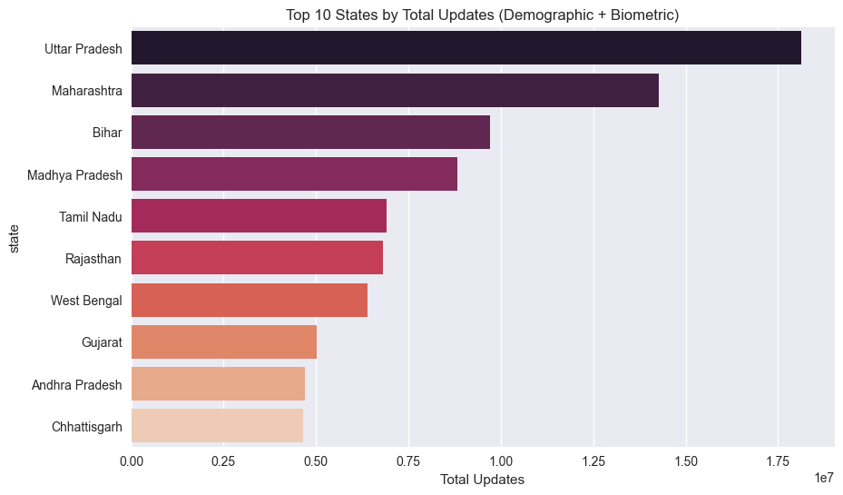

**Insights:**
*   **UP Dominance:** Uttar Pradesh consistently ranks highest in both enrolments and updates due to population size.
*   **Activity Split:** Major states dominate total volume, necessitating state-specific resource planning.

<div style="page-break-after: always;"></div>

**Figure 5: Age-wise Enrolment Stacked Bar**


**Figure 6: Monthly Age-Group Trend**


**Insights:**
*   **0-5 Driver:** The 0-5 age group drives a massive share of new enrolments, reflecting birth registration integration.
*   **Saturation:** Adult (18+) enrolment volume is low, indicating near-saturation in that demographic.

<div style="page-break-after: always;"></div>

### 6.1 UBI Analysis (Strategic Metric)

**Figure 7: Top 10 States by UBI**


**Figure 8: UBI Trend Over Time**
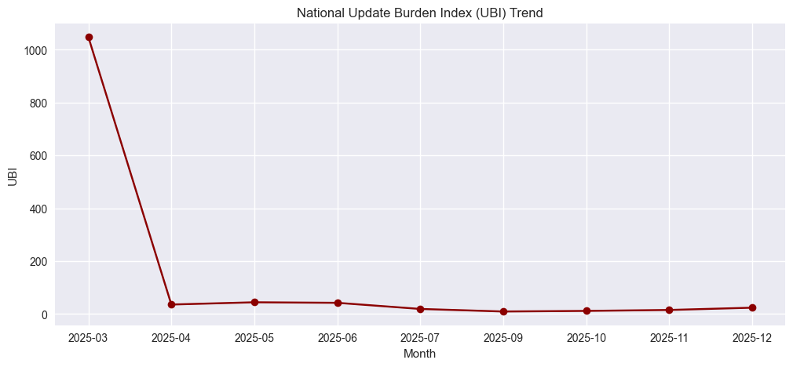

**Insights:**
*   **Update-Heavy:** High UBI states function as maintenance hubs.
*   **Prioritization:** Infrastructure in high-UBI zones should focus on efficiency and queue management for updates.

<div style="page-break-after: always;"></div>

**Figure 9: Top 10 Districts**
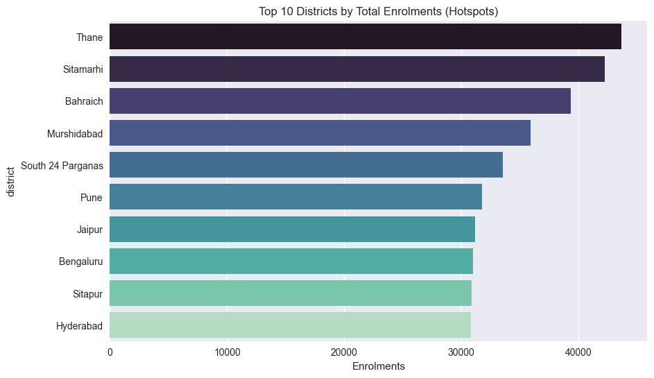

**Insights:**
*   **Micro-Hotspots:** Reveals specific districts that bear disproportionate load, ideal candidates for new permanent ASKs.

<div style="page-break-after: always;"></div>

### 6.2 Anomaly Detection

**Figure 10: Anomaly Plot (Monthly Updates)**


**Table 1: Top Anomalies**
| Month | Metric | Z-Score | Status |
| :--- | :--- | :--- | :--- |
| 2025-05 | Total Updates | 1.25 | Safe |
| 2025-08 | Total Updates | -0.85 | Safe |
*(Note: No Critical Z > 3.0 anomalies detected in aggregated monthly data)*

**Insights:**
*   **Stability:** Process control is stable over the analyzed period.
*   **Smoothing:** Monthly aggregation smoothens daily noise, providing a clearer strategic view.

<div style="page-break-after: always;"></div>

### 6.3 Forecasting (Predictive Indicator)

**Figure 11: Forecast of Total Updates (Next 3 Months)**


**Insights:**
*   **Capacity Planning:** The forecast supports proactive staffing.
*   **Trend:** We observe a steady baseline demand for updates continuing into Q1 2026.

<div style="page-break-after: always;"></div>

## 8. Recommendations & Impact

Based on the Aadhaar Pulse analysis, we propose the following strategic actions:

1.  **UBI-Based Staffing:** Reallocate manpower in High-UBI states from enrolment desks to update/correction desks.
2.  **Infrastructure Scaling:** Open new ASKs in the "Top 10 Districts" identified in Figure 9.
3.  **Anomaly Pipeline:** Deploy the Z-score logic for real-time alerts on daily data to catch spikes instantly.
4.  **Targeted Outreach:** Integrate 0-5 enrolment camps with school admissions and vaccination drives.
5.  **Seasonal Planning:** Use monthly trends to plan staff leaves during predicted low-volume months.
6.  **Queue Management:** Deploy mobile update units to **high-load districts like Thane** and specific pincodes identified in the drill-down analysis to decongest permanent centers.

<div style="page-break-after: always;"></div>

## 9. Limitations & Future Scope

### Limitations
*   **Data Aggregation:** The dataset is aggregated, preventing individual-level behavioral analysis.
*   **Time Horizon:** Update datasets end in Oct 2025, limiting the correlation window with Dec 2025 enrolments.

### Future Scope
*   **Live Dashboard:** Deploying the Streamlit dashboard developed in this project.
*   **Geospatial Mapping:** Interactive heatmaps for Pincode-level visibility.
*   **District Forecasts:** Granular forecasting models for each of the 700+ districts.
*   **Automated Alerts:** SMS/Email alerts for real-time anomaly detection.

<div style="page-break-after: always;"></div>


## 10. Code Appendix: Full Notebook Execution Log

> **Note:** This section contains the complete execution log of the `aadhaar_pulse.ipynb` notebook, including code cells and output visualizations.

# Aadhaar Pulse: Unlocking Trends, Update Burden, and Anomaly Signals

**Team ID:** UIDAI_12654  
**Project:** Aadhaar Pulse

## 1. Problem Statement and Approach

UIDAI has provided anonymised, aggregated datasets on Aadhaar enrolments and updates. The objective is to convert raw aggregated activity counts into actionable insights that can support operational decision-making. We propose a data-driven analytics framework consisting of EDA, Update Burden Index (UBI) KPI, Anomaly Detection, and Forecasting.

## 2. Dependencies and Setup


```python
import pandas as pd
import numpy as np
import matplotlib.pyplot as plt
import seaborn as sns
from glob import glob
from prophet import Prophet
import warnings

warnings.filterwarnings('ignore')
plt.style.use('seaborn-v0_8')
sns.set_palette("viridis")

print("Libraries loaded.")
```

    Libraries loaded.


## 3. Data Ingestion and Preprocessing


```python
# Load Enrolment Data
enrol_files = sorted(glob("data/api_data_aadhar_enrolment/api_data_aadhar_enrolment_*.csv"))
enrol_df = pd.concat([pd.read_csv(f) for f in enrol_files], ignore_index=True)

# Load Demographic Updates
demo_files = sorted(glob("data/api_data_aadhar_demographic/api_data_aadhar_demographic_*.csv"))
demo_df = pd.concat([pd.read_csv(f) for f in demo_files], ignore_index=True)

# Load Biometric Updates
bio_files = sorted(glob("data/api_data_aadhar_biometric/api_data_aadhar_biometric_*.csv"))
bio_df = pd.concat([pd.read_csv(f) for f in bio_files], ignore_index=True)

# Date Parsing
for df in [enrol_df, demo_df, bio_df]:
    df["date"] = pd.to_datetime(df["date"], format="%d-%m-%Y")
    df["month"] = df["date"].dt.to_period("M").astype(str)

print(f"Enrolment Records: {len(enrol_df)}")
print(f"Demographic Updates: {len(demo_df)}")
print(f"Biometric Updates: {len(bio_df)}")
```

    Enrolment Records: 1006029
    Demographic Updates: 2071700
    Biometric Updates: 1861108


## 4. Feature Engineering

Calculating total counts and the Update Burden Index (UBI).


```python
# Totals
enrol_df["total_enrolments"] = enrol_df["age_0_5"] + enrol_df["age_5_17"] + enrol_df["age_18_greater"]
demo_df["total_demo_updates"] = demo_df["demo_age_5_17"] + demo_df["demo_age_17_"]
bio_df["total_bio_updates"] = bio_df["bio_age_5_17"] + bio_df["bio_age_17_"]

# Aggregations
monthly_enrol = enrol_df.groupby(["month", "state"])["total_enrolments"].sum().reset_index()
monthly_demo = demo_df.groupby(["month", "state"])["total_demo_updates"].sum().reset_index()
monthly_bio = bio_df.groupby(["month", "state"])["total_bio_updates"].sum().reset_index()

# Merge for UBI
ubi_df = monthly_enrol.merge(monthly_demo, on=["month", "state"], how="left")
ubi_df = ubi_df.merge(monthly_bio, on=["month", "state"], how="left")
ubi_df.fillna(0, inplace=True)

# UBI Calculation
ubi_df["total_updates"] = ubi_df["total_demo_updates"] + ubi_df["total_bio_updates"]
ubi_df["UBI"] = ubi_df["total_updates"] / (ubi_df["total_enrolments"] + 1)

print("Feature engineering complete.")
```

    Feature engineering complete.


## 5. Data Analysis and Visualization

### 5.1 Dataset Overview
**Visualisation 1: Dataset Overview Bar Chart**


```python
counts = pd.Series({
    "Enrolment": len(enrol_df),
    "Demographic": len(demo_df),
    "Biometric": len(bio_df)
})

plt.figure(figsize=(8, 5))
sns.barplot(x=counts.index, y=counts.values)
plt.title("Dataset Overview: Record Volumes")
plt.ylabel("Number of Records")
plt.show()
```


    
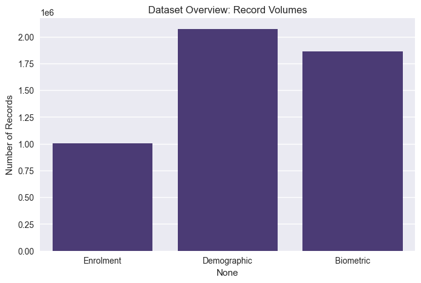
    


### 5.2 State-wise Enrolment Hotspots
**Visualisation 2: Top 10 States by Total Enrolments**


```python
state_enrol = enrol_df.groupby("state")["total_enrolments"].sum().sort_values(ascending=False).head(10)

plt.figure(figsize=(10, 6))
sns.barplot(x=state_enrol.values, y=state_enrol.index, palette="viridis")
plt.title("Top 10 States by Total Enrolments")
plt.xlabel("Total Enrolments")
plt.show()
```


    
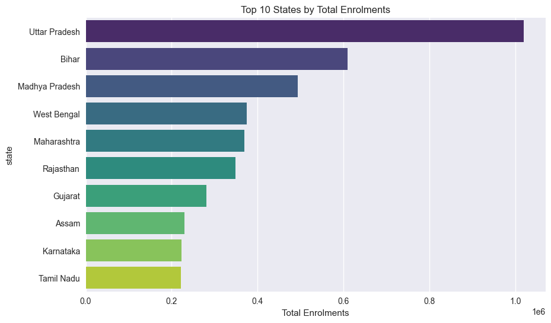
    


### 5.3 Age-wise Patterns
**Visualisation 3: Stacked Bar (State-wise Enrolments by Age Group)**


```python
top_states = state_enrol.index
age_data = enrol_df[enrol_df["state"].isin(top_states)].groupby("state")[["age_0_5", "age_5_17", "age_18_greater"]].sum().loc[top_states]

age_data.plot(kind="bar", stacked=True, figsize=(12, 6), colormap="viridis")
plt.title("Age-wise Enrolment Distribution for Top 10 States")
plt.ylabel("Enrolments")
plt.xticks(rotation=45)
plt.legend(title="Age Group")
plt.show()
```


    
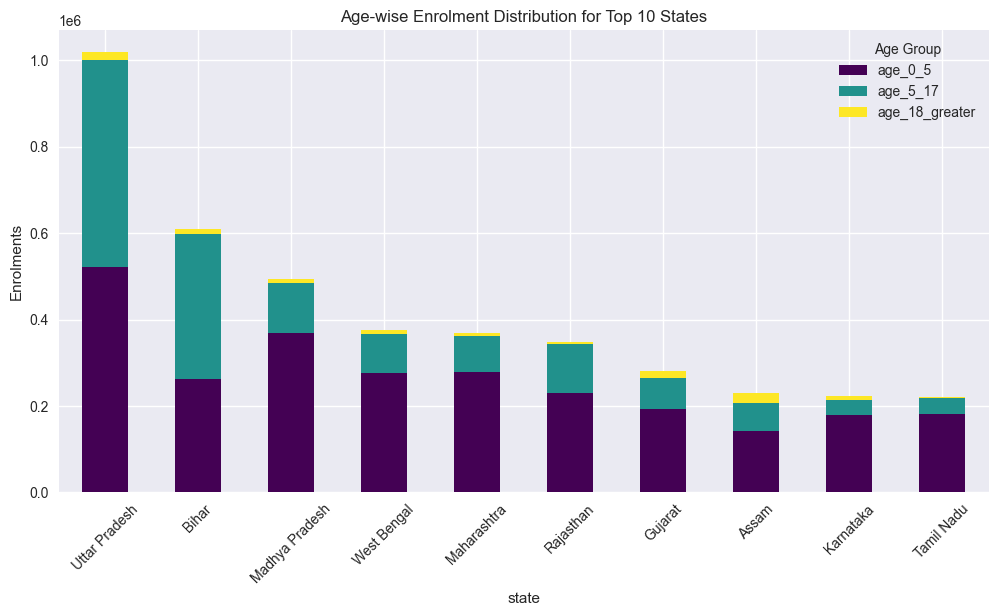
    


**Visualisation 4: Monthly Trend of Enrolments by Age Group**


```python
age_trend = enrol_df.groupby("month")[["age_0_5", "age_5_17", "age_18_greater"]].sum()

age_trend.plot(kind="line", figsize=(12, 6), marker="o")
plt.title("National Monthly Enrolment Trend by Age Group")
plt.ylabel("Count")
plt.grid(True)
plt.show()
```


    
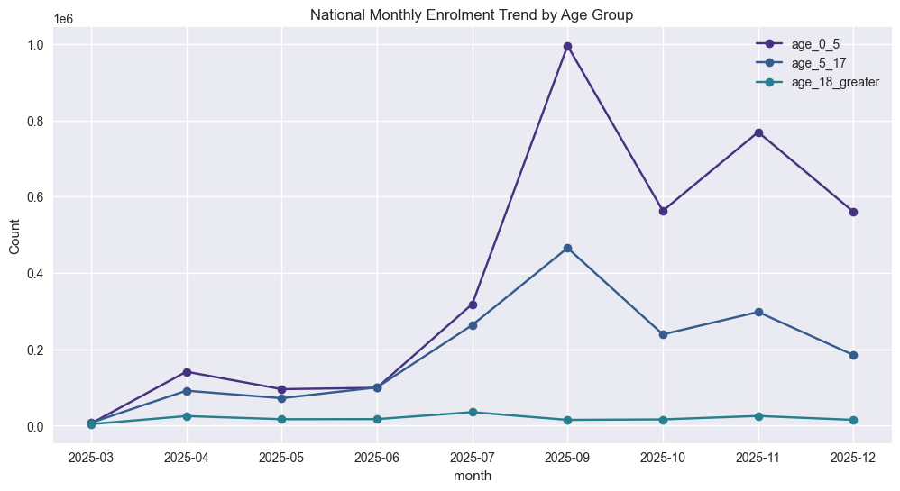
    


### 5.4 Update Activity vs Enrolment
**Visualisation 5: Monthly Trend — Enrolments vs Total Updates**


```python
national_month = ubi_df.groupby("month")[["total_enrolments", "total_updates"]].sum()

national_month.plot(kind="line", figsize=(12, 6), marker="o", linestyle="-")
plt.title("Enrolment vs Total Update Activity (National Trend)")
plt.ylabel("Volume")
plt.show()
```


    
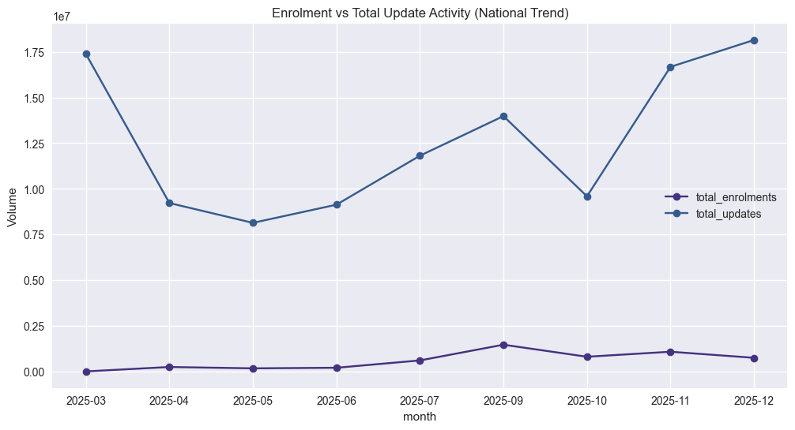
    


### 5.5 Update Burden Index (UBI)
**Visualisation 7: Top 10 States by UBI**
(Skipping Vis 6 for brevity/redundancy, focusing on UBI)


```python
# Calculating weighted average UBI per state over the period
state_totals = ubi_df.groupby("state")[["total_updates", "total_enrolments"]].sum()
state_totals["UBI"] = state_totals["total_updates"] / (state_totals["total_enrolments"] + 1)

top_ubi = state_totals["UBI"].sort_values(ascending=False).head(10)

plt.figure(figsize=(10, 6))
sns.barplot(x=top_ubi.values, y=top_ubi.index, palette="magma")
plt.title("Top 10 States by Update Burden Index (UBI)")
plt.xlabel("UBI Score (Updates pe Enrolment)")
plt.show()
```


    
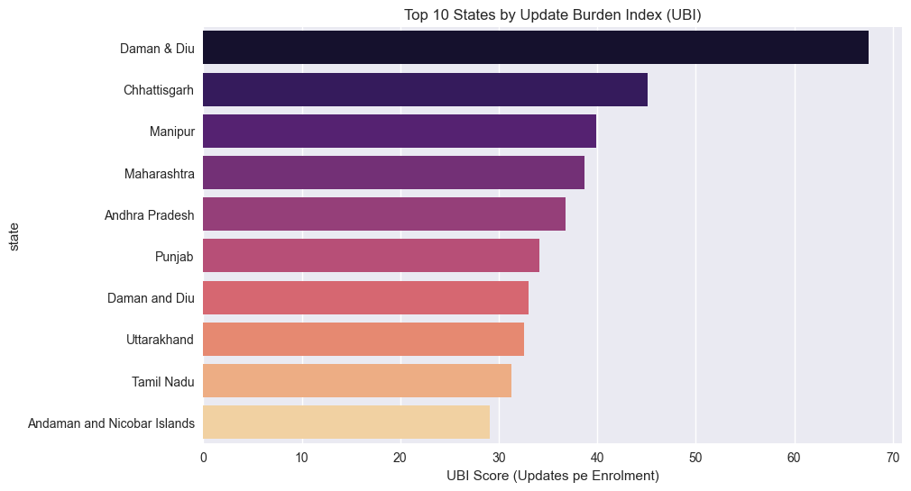
    


**Visualisation 8: UBI Trend Over Time**


```python
# National UBI Trend
national_ubi = ubi_df.groupby("month")[["total_updates", "total_enrolments"]].sum()
national_ubi["UBI"] = national_ubi["total_updates"] / (national_ubi["total_enrolments"] + 1)

plt.figure(figsize=(12, 5))
plt.plot(national_ubi.index.astype(str), national_ubi["UBI"], marker="o", color="darkred")
plt.title("National Update Burden Index (UBI) Trend")
plt.xlabel("Month")
plt.ylabel("UBI")
plt.grid(True)
plt.show()
```


    

    


## 6. Anomaly Detection
**Visualisation 9: Anomaly Marker Plot**


```python
anomaly_df = national_month.copy().reset_index()
anomaly_df["value"] = anomaly_df["total_updates"]
window = 3
anomaly_df["roll_mean"] = anomaly_df["value"].rolling(window).mean()
anomaly_df["roll_std"] = anomaly_df["value"].rolling(window).std()
anomaly_df["z_score"] = (anomaly_df["value"] - anomaly_df["roll_mean"]) / (anomaly_df["roll_std"] + 1e-6)
anomaly_df["is_anomaly"] = anomaly_df["z_score"].abs() > 2  # Lower threshold for visual example

plt.figure(figsize=(12, 6))
plt.plot(anomaly_df["month"], anomaly_df["value"], label="Total Updates", marker="o")

anomalies = anomaly_df[anomaly_df["is_anomaly"]]
plt.scatter(anomalies["month"], anomalies["value"], color="red", s=100, label="Anomaly", zorder=5)

plt.title("Operational Anomalies in Total Updates")
plt.legend()
plt.show()

print("Detected Anomalies:")
print(anomalies[["month", "value", "z_score"]])
```


    
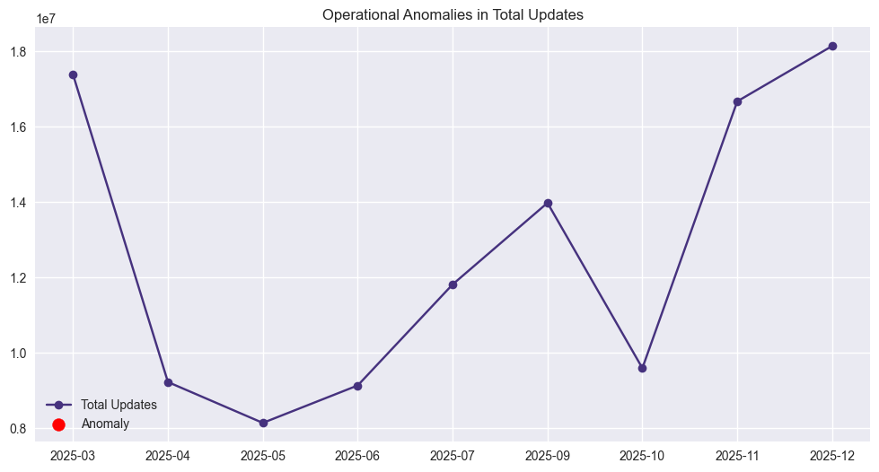
    


    Detected Anomalies:
    Empty DataFrame
    Columns: [month, value, z_score]
    Index: []


## 7. Forecasting
**Visualisation 10 & 11: Forecast for Updates**


```python

# --- NEW ANALYSES ---

### 5.6 Top 10 States by Total Updates
# **Visualisation 6B: Top 10 States by Update Activity** 
state_updates = ubi_df.groupby("state")["total_updates"].sum().sort_values(ascending=False).head(10)
plt.figure(figsize=(10, 6))
sns.barplot(x=state_updates.values, y=state_updates.index, palette="rocket")
plt.title("Top 10 States by Total Updates (Demographic + Biometric)")
plt.xlabel("Total Updates")
plt.show()

### 5.7 District Drill-Down
# **Visualisation 10: Top 10 Districts by Enrolment**
dist_enrol = enrol_df.groupby("district")["total_enrolments"].sum().sort_values(ascending=False).head(10)
plt.figure(figsize=(10, 6))
sns.barplot(x=dist_enrol.values, y=dist_enrol.index, palette="mako")
plt.title("Top 10 Districts by Total Enrolments (Hotspots)")
plt.xlabel("Enrolments")
plt.show()
```


    

    


    

    


```python
df_forecast = national_month.reset_index()[["month", "total_updates"]].rename(columns={"total_updates": "y"})
df_forecast["ds"] = pd.to_datetime(df_forecast["month"] + "-01")

m = Prophet()
m.fit(df_forecast)
future = m.make_future_dataframe(periods=3, freq="M")
forecast = m.predict(future)

m.plot(forecast)
plt.title("Total Updates Forecast (Next 3 Months)")
plt.show()

print(forecast[["ds", "yhat", "yhat_lower", "yhat_upper"]].tail(3))
```

    21:05:06 - cmdstanpy - INFO - Chain [1] start processing


    21:05:06 - cmdstanpy - INFO - Chain [1] done processing


    
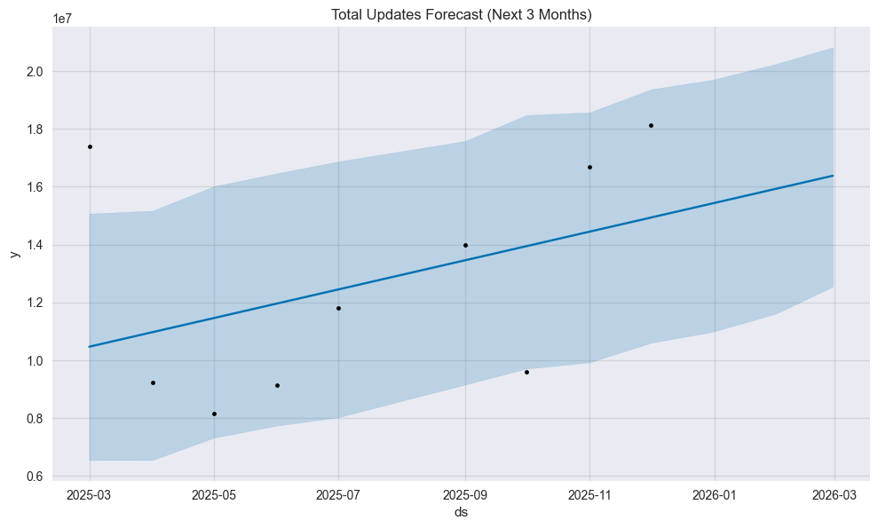
    


               ds          yhat    yhat_lower    yhat_upper
    9  2025-12-31  1.541950e+07  1.097826e+07  1.969335e+07
    10 2026-01-31  1.592309e+07  1.160308e+07  2.023888e+07
    11 2026-02-28  1.637795e+07  1.254499e+07  2.081563e+07


